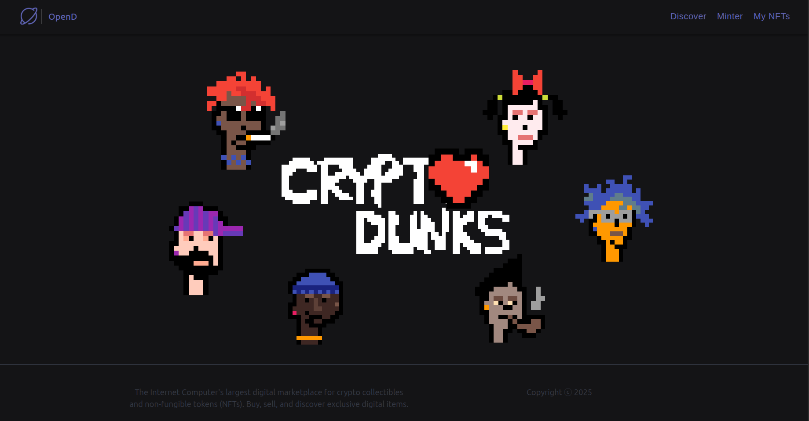
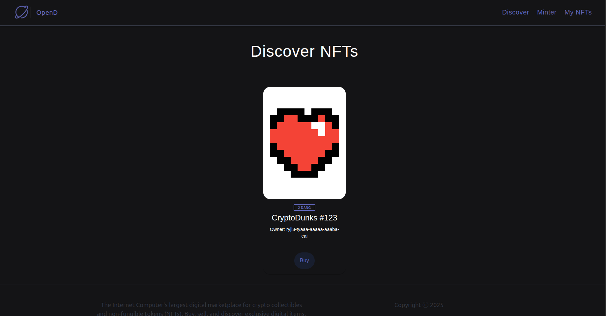
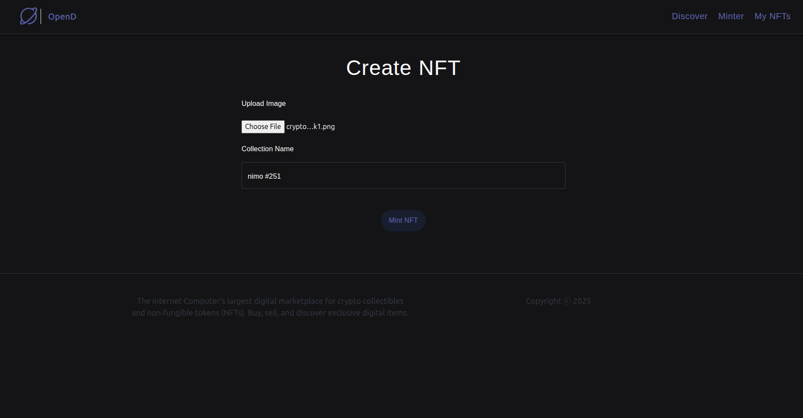
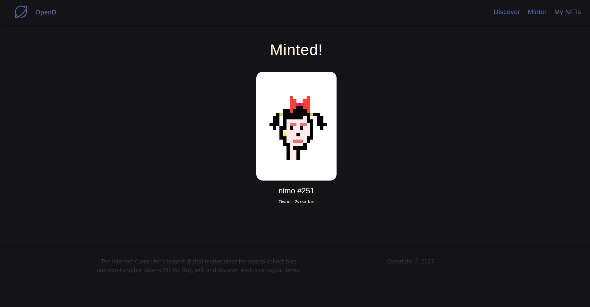
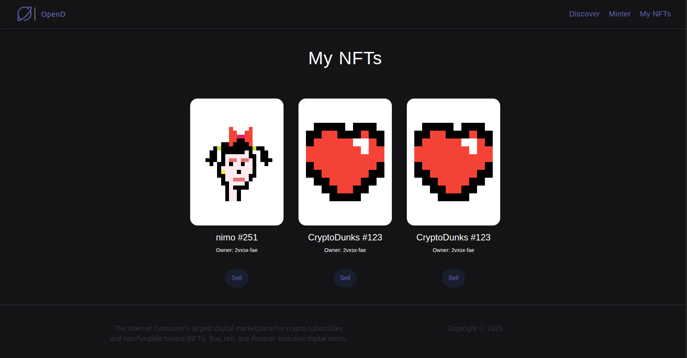
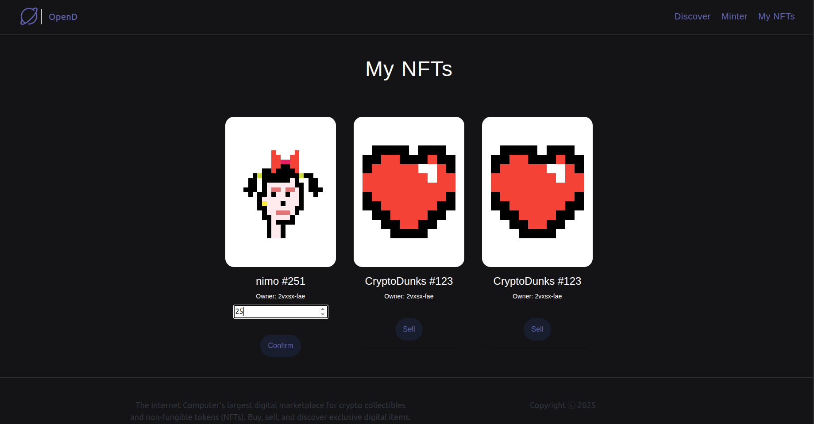

# OpenD – NFT Marketplace on Internet Computer (ICP)

OpenD is a decentralized NFT marketplace built on the **Internet Computer (ICP)**.
It allows users to **mint NFTs**, **list them for sale**, **discover listed NFTs**, and **manage their personal NFT collections**.

The project uses **Motoko** for backend canisters and **React** for the frontend, following ICP best practices with a clear separation between NFT logic, marketplace logic, and token accounting.

---

## 📹 Demo Video

Click on the image below to watch the demo on YouTube:

[](https://www.youtube.com/watch?v=O17JqA9Ym1k)

---

## 📸 Screenshots

### Home


### Discover NFTs



### Mint NFT




### My NFTs




---

## 🧠 Architecture Overview

The project is composed of multiple canisters:

- **OpenD Canister**

  - Marketplace logic
  - Listing NFTs for sale
  - Buying NFTs
  - Tracking ownership

- **NFT Canisters**

  - Each NFT is deployed as a separate canister
  - Handles NFT metadata and ownership transfer

- **Token Canister (External)**

  - Used for tracking balances and payments
  - **Deployed in a separate project**
  - Integrated via canister calls

🔗 **Token Canister Repository:**
👉 _https://github.com/abdo-ali/token_

---

## 🛠 Tech Stack

- **Internet Computer (ICP)**
- **Motoko** (Backend Canisters)
- **React.js** (Frontend)
- **@dfinity/agent**
- **DFX SDK**
- **WebPack**

---

## Getting Started (Local Development)

### 1️⃣ Start the local Internet Computer replica

```bash
dfx start --clean
```

### 2️⃣ Install dependencies and run the frontend

```bash
npm install
npm start
```

### 3️⃣ Deploy canisters

```bash
dfx deploy
```

### 4️⃣ Open the app in your browser

```
http://localhost:8080
```

---

## 🧪 Creating NFTs for Testing (CLI)

### Mint an NFT

```bash
dfx canister call opend mint '(vec { ...image bytes... }, "CryptoDunks #123")'
```

### List NFT for sale

```bash
dfx canister call opend listItem '(principal "<NFT_CANISTER_ID>", 2)'
```

### Transfer NFT ownership to OpenD

```bash
dfx canister call <NFT_CANISTER_ID> transferOwnership '(principal "<OPEND_CANISTER_ID>", true)'
```

---

## 🔗 Connecting to the Token Canister

1. Copy the `token` declarations folder into your project
2. Replace the token canister ID in the code:

```js
const dangPrincipal = Principal.fromText("<REPLACE_WITH_TOKEN_CANISTER_ID>");
```

The token canister is responsible for:

- Tracking user balances
- Handling transfers during NFT purchases

---

## 📂 Project Structure (Simplified)

```text
src/
├── NFT/                # NFT canister (Motoko)
├── opend/              # Marketplace canister (Motoko)
├── declarations/       # Auto-generated canister bindings
├── opend_assets/       # Frontend (React)
```

---

## 📜 License

### Apache License 2.0

This project includes code originally provided as part of a tutorial by
**London App Brewery LTD** ([https://www.appbrewery.com](https://www.appbrewery.com)).

The original tutorial code is licensed under the **Apache License, Version 2.0**.

You may obtain a copy of the License at:

```
http://www.apache.org/licenses/LICENSE-2.0
```

Unless required by applicable law or agreed to in writing, software distributed under
the License is distributed on an **"AS IS" BASIS**, WITHOUT WARRANTIES OR CONDITIONS OF
ANY KIND, either express or implied.

A TL;DR version of the license:
[https://tldrlegal.com/license/apache-license-2.0-(apache-2.0)](https://tldrlegal.com/license/apache-license-2.0-%28apache-2.0%29)

---

## 🙏 Credits

- Original tutorial by **London App Brewery**
- Extended, refactored, and enhanced by **Abdelrahman Ali**
- Architecture adapted for real-world Internet Computer (ICP) development

---

## 📌 Notes

- This project is intended for **learning and portfolio purposes**
- Token accounting is intentionally separated into an external canister to reflect
  real-world decentralized architecture on ICP
